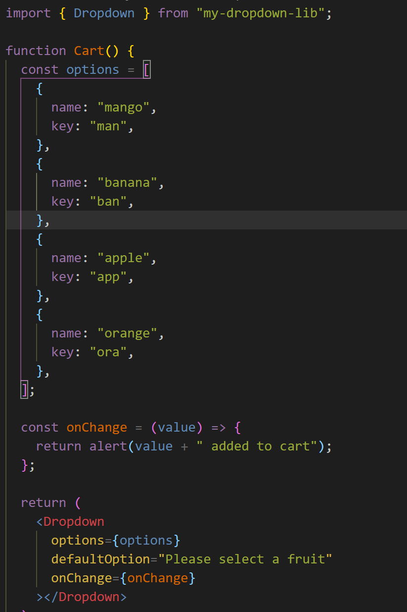
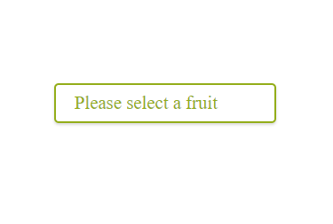
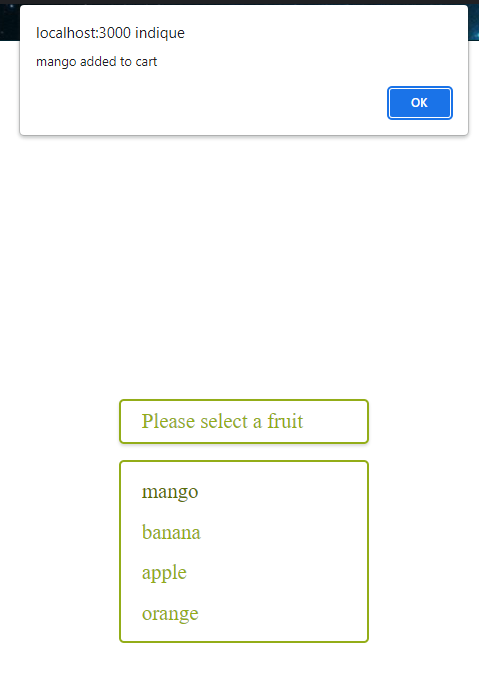

# my-dropdown-lib

A simple React library created using `create-react-app`.

It allows you to create a custom selectable component with 3 props

## Installation

Run the following command:
`npm install my-dropdown-lib`

## Controllable Props

| Prop name     | Description                                                   |
| ------------- | ------------------------------------------------------------- |
| options       | **_array_** The list of options                               |
| defaultOption | **_string_** The message seen in the header by default        |
| onChange      | **_function_** Gets the value of the clicked option in params |

## Demo

### Code

### Device

